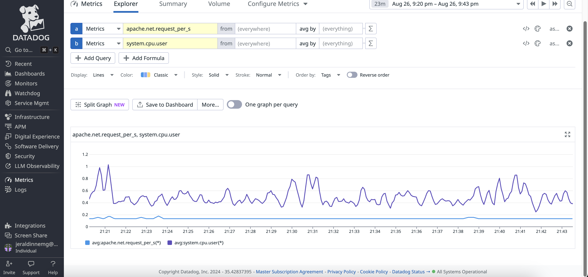

# Datadog Fundamentals Course - Demo Exercises

This is a repository for the Datadog Fundamentals course! This repository contains various demo exercises that showcase the features and capabilities of Datadog.

## Table of Contents

- Demo: Install the Apache and PHP Integrations

- Demo: Deploy a Demo Server Using an AWS CloudFormation Template

- Demo: Create a CPU Spike Using Stress

- Demo: Create a Custom Dashboard

- Demo: APM Setup and Configuration

- Demo: Synthetic Monitoring Configuration

- Demo: Alerts configuration.
 

## Demo 4: Deploy a Demo Server Using an AWS CloudFormation Template

To follow along with the Datadog Fundamentals course, you'll need a server. The server will be used to represent the demo server being used by Globomantics to explore the features of the Datadog service.

### Server Specifications

- **Operating System**: Amazon Linux 2

- **Web Server**: Apache HTTPD

- **PHP Processor**: PHP-FPM

- **Content Management System**: WordPress

### Deploying the Demo Server

The AWS CloudFormation service provides templates that we can use to deploy a server with these specs. Follow these steps to deploy your demo server using a CloudFormation template.

### Install the Datadog Agent

The Datadog Agent is software that runs on your hosts. It collects events and metrics from hosts and sends them to Datadog, where you can analyze your monitoring and performance data. The Datadog Agent is open source and its source code is available on GitHub at DataDog/datadog-agent.
 

## Demo: Create a Custom Dashboard

In this demo, we're tasked with creating a dashboard that reports the rate of requests being served by the Globomantics web servers.

## Demo: APM Setup and Configuration

In this demo, we're configuring our Globomantics server to report APM metrics to Datadog.

 

## Demo: Synthetic Monitoring Configuration

In this demo, we're configuring synthetic monitoring for one of the Globomantics demo servers.
 

## Key Insights About Datadog

- **Comprehensive Monitoring**: Datadog provides end-to-end visibility across your entire infrastructure, including servers, databases, applications, and services.

- **Real-time Metrics**: Collect and analyze metrics in real-time to quickly identify and resolve performance issues.

- **Integrations**: Datadog supports a wide range of integrations, making it easy to monitor various technologies and services.

- **Dashboards**: Create custom dashboards to visualize your data and gain insights into your system's performance.

- **Alerts**: Set up alerts to notify you of potential issues before they impact your users.

- **APM**: Application Performance Monitoring (APM) helps you trace requests across your distributed system and identify bottlenecks.

- **Synthetic Monitoring**: Simulate user interactions to ensure your applications are performing as expected.

## Datadog fundamentals demo 
- AWS EC2 instances

- CloudFormation AWS

- Datadog integration

- Datadog webservers

- EC2 Amazon linux ssh

- Datadog metrics

- Datadog metrics

- API Syntetic test

- Custom dashboard

- Apache monitoring service

- Test results

- Hostlist datadog

- Integration datadog

- Alerts configured

